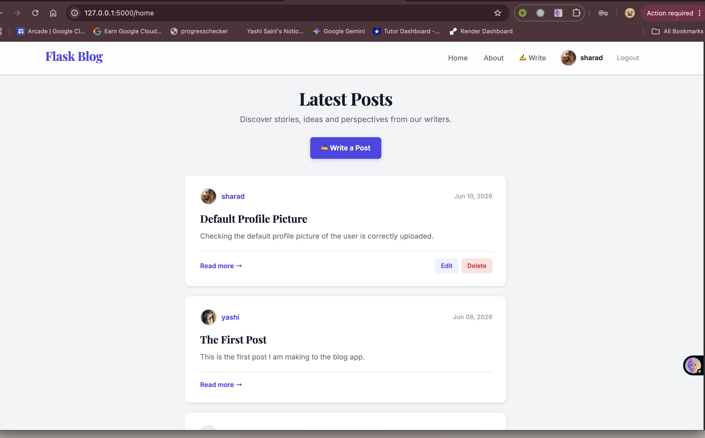
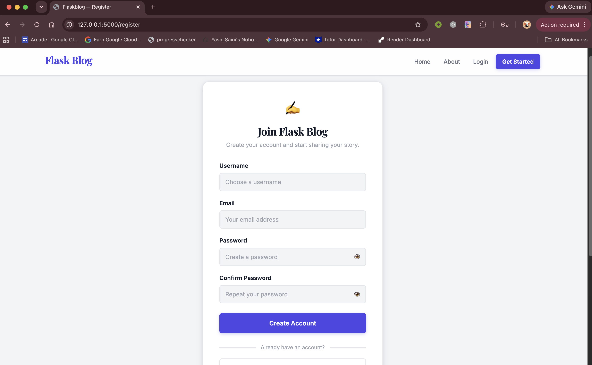
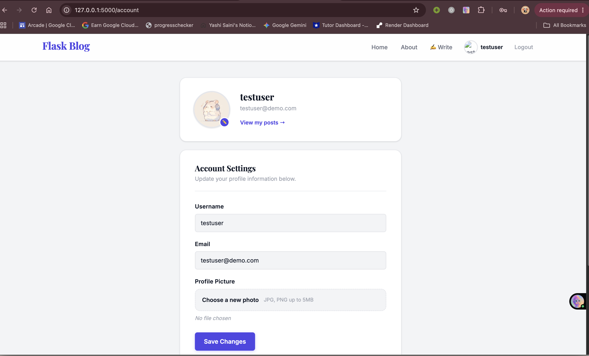
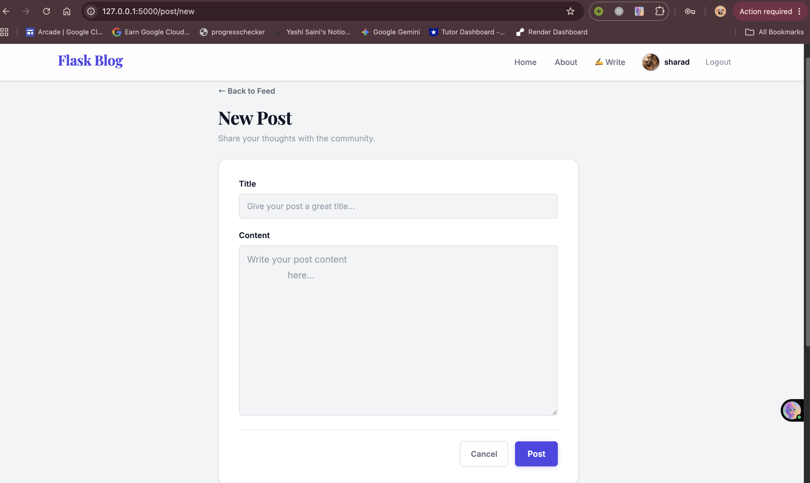
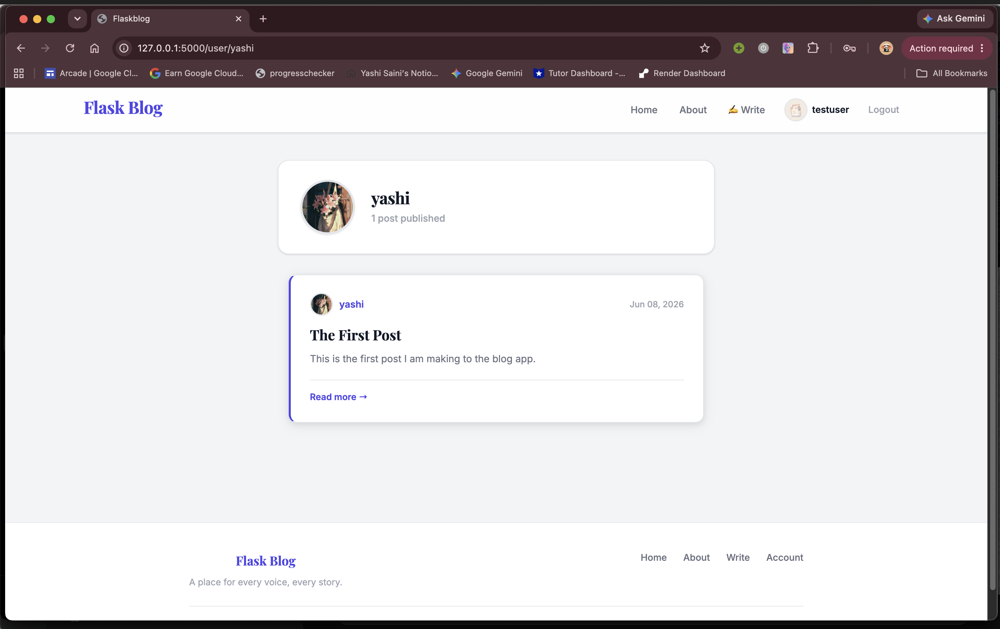

# Flask Blog Application

A production-ready blog web application built using Flask that allows users to create accounts, publish blog posts, manage profiles, and interact with a dynamic blogging platform.

The application follows secure development practices and is deployed using modern cloud services including Render, Neon PostgreSQL, and Cloudinary.

---

## Live Demo

🔗 https://flask-blog-app-jjbb.onrender.com

---

## Screenshots


### Home Page

<p align="center">
  
</p>

### User Registration

<p align="center">
  
</p>

### Profile Management

<p align="center">
  
</p>

### Create New Post

<p align="center">
  
</p>

### User Post

<p align="center">
  
</p>

---

## Features

### User Authentication

* User registration and login
* Secure session management
* Password reset via email
* Account profile management

### Blog Management

* Create blog posts
* Edit existing posts
* Delete posts
* View posts by different users
* Pagination support

### Profile Management

* Upload profile pictures
* Cloud-based image storage using Cloudinary
* Automatic image delivery and management

### Security

* Password hashing
* CSRF protection
* Secure environment variable management
* Authentication and authorization checks

### Error Handling

* Custom 404 error page
* Custom 403 error page
* Custom 500 error page
* User-friendly error messages

---

## Tech Stack

### Backend

* Python
* Flask
* SQLAlchemy
* Flask-WTF
* Flask-Login
* Flask-Mail

### Database

* SQLite (Development)
* PostgreSQL (Production)
* Neon PostgreSQL

### Frontend

* HTML
* CSS
* Jinja2 Templates
* Bootstrap

### Cloud Services

* Render (Deployment)
* Neon (Database Hosting)
* Cloudinary (Image Storage)

### Database Migration

* Flask-Migrate
* Alembic

### Development Tools

* Git
* GitHub
* pip

---

## Deployment Architecture

The application is deployed using cloud-native services:

* Flask application hosted on Render
* PostgreSQL database hosted on Neon
* User profile images stored on Cloudinary
* Environment variables used for credential management
* Database schema migrations managed using Flask-Migrate

---

## Project Structure

```text
flask-blog-app
│
├── app/
│   ├── users/
│   ├── posts/
│   ├── errors/
│   ├── templates/
│   ├── static/
│   ├── __init__.py
│   ├── config.py
│   └── models.py
│
├── migrations/
├── run.py
├── requirements.txt
├── .env
├── .gitignore
└── README.md
```

---

## Installation and Setup

### Clone Repository

```bash
git clone https://github.com/yashisaini718/flask-blog-app.git
cd flask-blog-app
```

### Create Virtual Environment

```bash
python -m venv venv
```

Activate:

```bash
# Windows
venv\Scripts\activate

# Linux/Mac
source venv/bin/activate
```

### Install Dependencies

```bash
pip install -r requirements.txt
```

### Configure Environment Variables

Create a `.env` file and add:

```env
SECRET_KEY=your_secret_key
DATABASE_URL=your_database_url
MAIL_USERNAME=your_email
MAIL_PASSWORD=your_password
CLOUDINARY_CLOUD_NAME=your_cloud_name
CLOUDINARY_API_KEY=your_api_key
CLOUDINARY_API_SECRET=your_api_secret
```

### Run Application

```bash
python run.py
```

Application runs at:

```text
http://127.0.0.1:5000
```

---

## Database Migration

The application was initially developed using SQLite and later migrated to PostgreSQL hosted on Neon.

Migration management is handled using Flask-Migrate and Alembic.

Common commands:

```bash
flask db init
flask db migrate -m "Initial Migration"
flask db upgrade
```

---

## Security Considerations

* Passwords are securely hashed before storage.
* CSRF protection is implemented on all forms.
* Sensitive credentials are stored using environment variables.
* Secret keys are excluded from version control.
* User authorization checks prevent unauthorized modifications.

---

## Learning Outcomes

Through this project I gained hands-on experience with:

* Flask application development
* Authentication and authorization
* SQLAlchemy ORM
* PostgreSQL database integration
* Database migration using Flask-Migrate
* Cloudinary image storage
* Production deployment using Render
* Secure credential management
* Modular application architecture using Blueprints
* Version control using Git and GitHub
